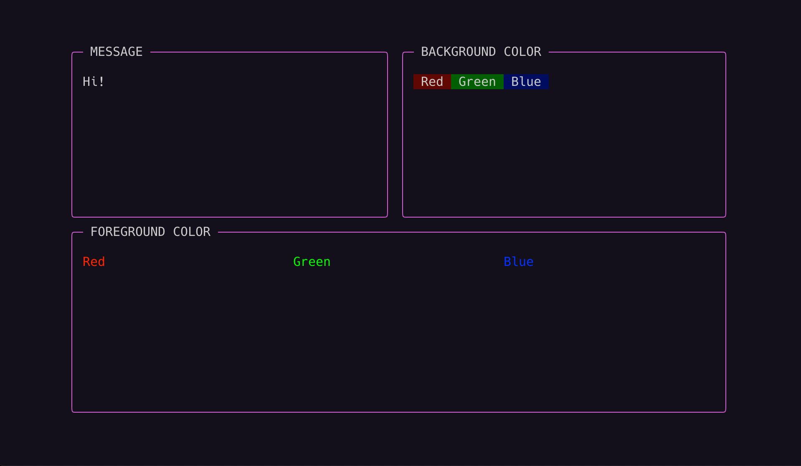

# tervi
[](https://pkg.go.dev/github.com/dytlzl/tervi) [](https://github.com/dytlzl/tervi/actions/workflows/ci.yaml)

Terminal UI library for Go

## Features
- [x] Declarative
- [x] Use Alternative Screen
- [x] Support 256 Color Code
- [x] Support Multibyte Characters

## Examples
Here is the first one to get you started:
```go
package main

import (
	"github.com/dytlzl/tervi/pkg/color"
	"github.com/dytlzl/tervi/pkg/tui"
)

func main() {
	err := tui.Run(func() *tui.View {
		return tui.VStack(
			tui.HStack(
				tui.VStack(tui.String("Hi!")).
					Title("MESSAGE").
					Border(tui.BorderOptionFGColor(color.RGB(200, 100, 200))),
				tui.Spacer().AbsoluteSize(1, 0),
				tui.InlineStack(
					tui.String(" Red ").BGColor(color.RGB(100, 0, 0)),
					tui.String(" Green ").BGColor(color.RGB(0, 100, 0)),
					tui.String(" Blue ").BGColor(color.RGB(0, 0, 100)),
				).
					Title("BACKGROUND COLOR").
					Border(tui.BorderOptionFGColor(color.RGB(200, 100, 200))),
			),
			tui.HStack(
				tui.String("Red").FGColor(color.RGB(255, 0, 0)),
				tui.String("Green").FGColor(color.RGB(0, 255, 0)),
				tui.String("Blue").FGColor(color.RGB(0, 0, 255)),
			).
				Title("FOREGROUND COLOR").
				Border(tui.BorderOptionFGColor(color.RGB(200, 100, 200))),
		).RelativeSize(10, 10)
	})
	if err != nil {
		panic(err)
	}
}
```
This example will render the Terminal UI as shown below.


