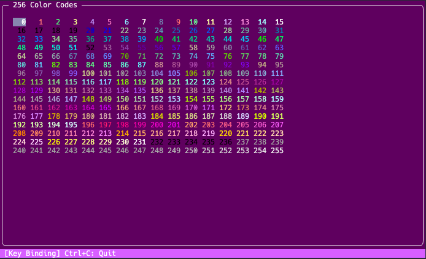
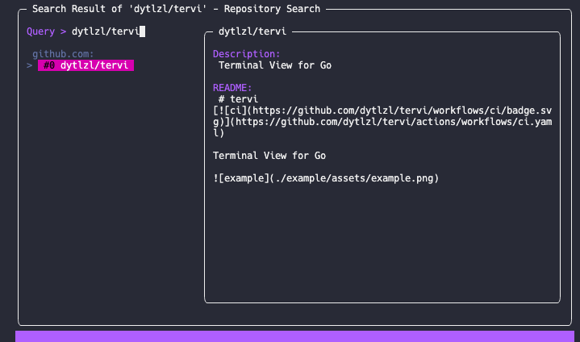

# tervi
 

Terminal View for Go

## Features
- [x] Use Alternative Screen
- [x] Support 256 Color Code
- [x] Support Multibyte Characters

## Examples
- Terminal Color Code Viewer

  

- Github Client

  
